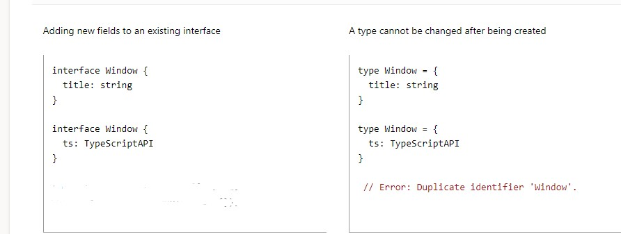
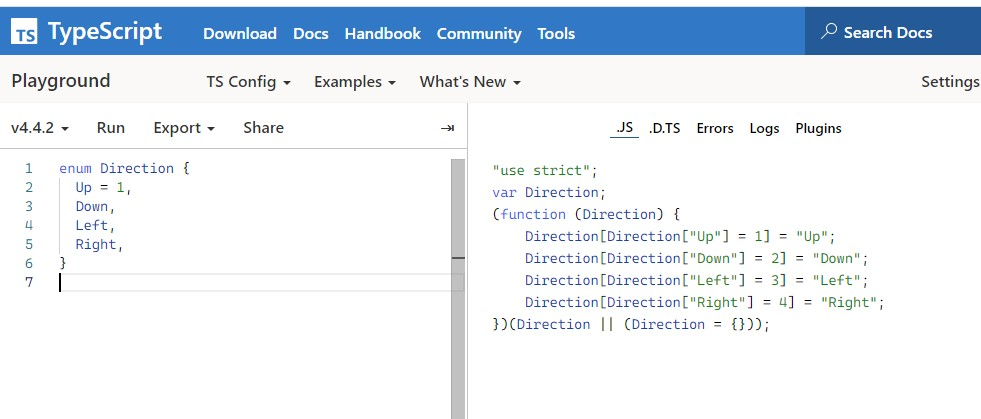

# TypeScript

--

1. [Основы TypeScript](#Основы-TypeScript)

- [Основные типы](#основные-типы)

- [Контекстная-типизация](#контекстная-типизация)
- [Работа с массивами](#работа-с-массивами)
- [Создание собственных типов](#создание-собственных-типов)
- [Присвоение конкретных значений переменной](#присвоение-конкретных-значений-переменной)

- [Композиция типов](#композиция-типов)
- [Создание интерфейсов](#создание-интерфейсов)
- [Отличие type от interface](#отличие-type-от-interface)

- [Типизация null и undefined](#типизация-null-и-undefined)
- [enum](#enum)
- [Numeric enum](#numeric-enum)
- [String enum](#string-enum)

  - [Работа с функциями в TS](#работа-с-функциями-в-ts)

    - [Типизация параметров](#типизация-параметров)
    - [Типизация возвращаемого значения](#типизация-возвращаемого-значения)
    - [Полная типизация функции](#полная-типизация-функции)
    - [Оператор spread в параметрах функции](#Оператор-spread-в-параметрах-функции)

  - [Работа с объектами](#работа-с-объектами)
  - [Создание интерфейсов для описания объектов](#создание-интерфейсов-для-описания-объектов)
  - [Типизация при динамическом наполнении объекта](#типизация-при-динамическом-наполнении-объекта)
  - [Наследование интерфейсов](#наследование-интерфейсов)

1.  [Работа с функциями в TS](#работа-с-функциями-в-ts)

    - [Типизация параметров](#типизация-параметров)
    - [Типизация возвращаемого значения](#типизация-возвращаемого-значения)

2.  [Работа с объектами](#работа-с-объектами)

- [Создание интерфейсов для описания объектов](#создание-интерфейсов-для-описания-объектов)
- [Типизация при динамическом наполнении объекта](#Типизация-при-динамическом-наполнении-объекта)
- [Описание объектов с методами](#Описание-объектов-с-методами)

---

3. [Работа с классами](#Работа-с-классами)

4. [Дженерики (общие типы)](#Дженерики)

   - [Наследование общих типов](#наследование-общих-тиров)
   - [Использование дженериков в interface](#Использование-дженериков-в-интерфейсе)
   - [Дженерики-для-классов](#Дженерики-для-классов)

5. [TypeScript в React](#typescript-в-react)
   - [Start](#start)
   - [Компоненты в React TS](#Компоненты-в-React-TS)
   - [Counter TS на классах](#Counter-TS-на-классах)
   - [Counter TS на хуках](#Counter-TS-на-хуках)

---

Для работы с TypeScript можно воспользоваться [интерактивной площадкой](https://www.typescriptlang.org/play?#code/PTAEHUFMBsGMHsC2lQBd5oBYoCoE8AHSAZVgCcBLA1UABWgEM8BzM+AVwDsATAGiwoBnUENANQAd0gAjQRVSQAUCEmYKsTKGYUAbpGF4OY0BoadYKdJMoL+gzAzIoz3UNEiPOofEVKVqAHSKymAAmkYI7NCuqGqcANag8ABmIjQUXrFOKBJMggBcISGgoAC0oACCoASMFmgY7p7ehCTkVOle4jUMdRLYTqCc8LEZzCZmoNJODPHFZZXVtZYYkAAeRJTInDQS8po+rf40gnjbDKv8LqD2jpbYoACqAEoAMsK7sUmxkGSCc+VVQQuaTwVb1UBrDYULY7PagbgUZLJH6QbYmJAECjuMigZEMVDsJzCFLNXxtajBBCcQQ0MwAUVWDEQNUgADVHBQGNJ3KAALygABEAAkYNAMOB4GRogLFFTBPB3AExcwABT0xnM9zsyhc9wASmCKhwDQ8ZC8iElzhB7Bo3zcZmY7AYzEg-Fg0HUiS58D0Ii8AoZTJZggFSRxAvADlQAHJhAA5SASAVBFQAeW+ZF2gldWkgx1QjgUrmkeFATgtOlGWH0KAQiBhwiudokkuiIgMHBx3RYbC43CCJSAA) или установить TS в составе React App.

---

## Основы TypeScript

В JavaScript есть только динамическая типизация, то есть мы не знаем об ошибках при неправильной передаче типов до выполнения программы.

Type Script (TS) - это надстройка над JS, которая позволяет делать строгую статическую типизацию, что делает поведение кода более предсказуемым и помогает делать отладку. TS синтаксически немного отличается от ванильного JS, но и стандартный код JS компилируется правильно в TS. Браузеры не поддерживают TS напрямую, поэтому перед отправкой в продакшн его нужно транспилировать в JS. Для этого используется TypeScript Compiler. Он устанавливается с помощью npm-пакета:

`npm install -g typescript`

_Если тайпскрипт установлен в составе react-app, этот пакет уже есть в зависимостях package.json_
_Поскольку TS - это не JS, для него используется другое расширение файлов - `file.ts`. в React - `.ts` или `tsx`_

### Основные типы

Наиболее часто используемые типы в TS:

- string - строка;
- number - число;
- boolean - логический оператор;
- [] - массив;

Для явного описания типов примитивов такой синтаксис:

```
const myName: string = "Alex";
const age: number = 5
const isAdmin: boolean = false

// Также возможна другая запись (полный аналог)
const myName = "Alex" as String;
const age = 5 as number
const isAdmin = false as boolean
```

Но в большинстве случаев описывать явно примитивы нет необходимости, так как TS определяет тип данных на основе переменной, которая инициализирует значение.

**Если даже явно не указывать тип, то при попытке его переопределить появится предупреждение**. Например:

```
let age: number = 5;
age = "seven";
console.log(age); // Type '"seven"' is not assignable to type 'number'.
```

#### Контекстная типизация

В приведенном ниже примере метод forEach принимает параметром анонимную функцию, куда передается name и происходит логирование с приведением входных параметров к верхнему регистру.

```
const names = ["Alice", "Bob", "Eve"];
names.forEach((name) => console.log(name.toUpperCase()));
```

Хотя у параметра **name** не описан тип `name:string`, TS определит это. Этот процесс называется контекстной типизацией, потому что контекст, в котором создана функция, сообщает, какой тип она должна иметь. Подробнее о том как это работает [можно почитать в документации в разделе Type Inference](https://www.typescriptlang.org/docs/handbook/type-inference.html)

### Работа с массивами

В большинстве случаев в масиве хранятся элементы одного типа, поэтому чаще всего встречается такая запись:

```
const users: string [] = ['Alex', 'Anna', 'Jack']

// также возможна такая нотация
const numbers: Array<number> = [1,2,3,4,5]
```

Массивы можно замораживать, т.е делать только для чтения. Для этого используется свойство `readonly`, о котором можно подробнее почитать [по ссылке](https://basarat.gitbook.io/typescript/type-system/readonly):

```
const arr: readonly number[] = [1, 2, 3, 4, 5];

// Также есть другая нотация
const arr: ReadonlyArray<number> = [1, 2, 3, 4, 5];


// После добавления параметра readonly у массива arr нет метода push
arr.push(6); // Property 'push' does not exist on type 'readonly number[]'

// Вручную тоже положить ничего не получится
arr[0] = 10; // Index signature in type 'readonly number[]' only permits reading.

```

Также можно более жестко указать содержимое массива:

```
const firstAndLastName: [string, string] = ["John", "Wayne"]; // В переменной может быть только 2 элемента типа string

const firstAndLastName: [string, string] = ["John", "Wayne", 'Duke']; // Type '[string, string, string]' is not assignable to type '[string, string]'.

```

[Подробнее об этом можно почитать по ссылке в разделе Tuple](https://www.typescriptlang.org/docs/handbook/basic-types.html)

### Создание собственных типов

Выше для firstAndLastName мы использовали объединения непосредственно в подписи самой переменной. Это удобно, но часто возникает необходимость использовать один и тот же тип более одного раза и обращаться к нему по одному имени. Для создания типов используется ключевое слово `type`:

```
type TFullNameUser = {
  firstName: string;
  lastName: string;
};

function getFullName(user: TFullNameUser) {
  console.log(`First name: ${user.firstName} lastName:${user.lastName}`);
}

getFullName({ firstName: "John", lastName: "Wayne" });

```

### Присвоение конкретных значений переменной

Помимо общих типов string и number, мы можем ссылаться на конкретные строки и числа в позициях типа.

```
let x: "hello" = "hello";

x = "hello"; // OK
x = "hey"; // Type '"hey"' is not assignable to type '"hello"'
```

Само по себе присвоение конкретных строк переменной не имеет особой ценности, но если комбинировать значения в союзы, можно извлечь из этого пользу. Например:

```
 type Coodrinates = [number, number]
 const coordinates: Coodrinates = [10,20] // если передать не number или не 2 аргумента, будет ошибка

type RequestStatus = "request" | "success" | "error"; // пропустит только одно из трех конкретных значений
const requestStatus: RequestStatus = "success";

```

То же самое в типизации параметров функции:

```
type Sex = "man" | "woman"

function getHumanGender(gender:Sex) {
  console.log(`User - ${gender}`);
}
getHumanGender("man"); // OK
getHumanGender("woman"); // OK
getHumanGender("dog"); // Argument of type '"dog"' is not assignable to parameter of type '"man" | "woman"'.
```

### Композиция типов

С помощью TS можно создавать новые типы на основе существующих. Один из паттернов - композиция типов. Для этого используется унарное ИЛИ `|`. В ряде случаев нужно предусмотреть, чтобы параметры функции обрабатывались методами, доступными только строке или только числу. Следующий пример позволяет передавать при вызове функции аргументы с типом number и string и при этом проверяет typeof для работы с методом, доступным только строке:

```
type ID = number | string;

function printId(id: ID) {
  if (typeof id === "string") {
    console.log(id.toUpperCase());
  } else {
    console.log(id);
  }
}
// OK
printId(101); // 101
// OK
printId("xyz202"); // XYZ202

```

Подробнее о паттернах комбинирования типов - [в документации по ссылке](https://www.typescriptlang.org/docs/handbook/literal-types.html#string-literal-types)

### Создание интерфейсов

Помимо alias type, создавать типы можно через interface

```
type objNumbers = {
  x: number;
  y: number;
};

// Синтаксически то же самое, но без знака '=' после имени интерфейса
interface objNumbers {
  x: number;
  y: number;
}

function print (num: objNumbers) {
  console.log("The coordinate's x value is " + num.x);
  console.log("The coordinate's y value is " + num.y);
}
print ({ x: 100, y: 100 });
```

### Отличие type от interface

И синтаксически, и функционально type и interface очень похожи. В обоих случаях можно создавать новые типы, наследуясь от предка.

```
// Наследование интерфейса
interface Shape {
  color: string
}

interface Square extends Shape {
  sideLength: number
}


// То же самое для типа
type Shape = {
  color: string
}

type Square = Shape & {
    sideLength: number
}


 объект может обязательно содержит свойство color, а также может содержать sideLength с типом number

let square = {
  color: 'black',
  sideLength: 15
} as Square

// Аналогичная запись

let square: Square = {
  color: 'black',
  sideLength: 15
}

```

Один из кейсов использования наследования типов - создание юзеров с разными правами, которые содержат отличающиеся наборы полей.

Преимущество интерфесов заключается в том, что их можно расширять новыми свойствами после создания, а для тайпов это недоступно:



Через type можно создавать и простые и объекто-подобные структуры данных, а через интерфейс только объекто-подобные.

Преимущество типов в том, что они могут использоваться для создания вычисляемых свойств при помощи ключевого слова in.

```
type Keys = "firstname" | "surname"

type DudeType = {
  [key in Keys]: string
}

const test: DudeType = {
  firstname: "Pawel",
  surname: "Grzybek"
}
```

для интерфейсов работа с вычимляемыми свойсвами недоступна:

```
interfase DudeInterface {
 [key in keys] : string; // будет ошибка
}
```

Типы полезны для типов объединения (например,` type MyType = TypeA | TypeB`), тогда как интерфейсы лучше подходят для описания объекто-подобных структур(например, `interface IUser{name: string; age: 20}`). Более подробное сравнение [по ссылке](https://react-typescript-cheatsheet.netlify.app/docs/basic/getting-started/basic_type_example/#useful-table-for-types-vs-interfaces)

Подробная статья с отличиями type и interface [по ссылке](https://pawelgrzybek.com/typescript-interface-vs-type/)

### Типизация null и undefined

В TS есть типы с соответствующими именами. Поведение этих типов зависит от того, включена ли опция strictNullChecks.

Если strictNullChecks выключен, значения, которые могут быть null или undefined, по-прежнему доступны в обычном режиме и могут быть присвоены свойству любого типа. Отсутствие проверки этих значений обычно является основным источником ошибок, поэтому лучше включать strictNullChecks.

При включении strictNullChecks, когда значение равно null или undefined, нужно будет проверить эти значения перед использованием методов или свойств.

```
function doSomething(x: number | null) {
  if (x === null) {
    return
  } else {
  console.log(x.toFixed());
  }
}
```

TS также имеет специальный синтаксис для удаления значений null и undefined из типа без какой-либо явной проверки. Пример ниже эквивлентен примеру выше

```
function doSomething(x?: number | null) {
  console.log(x!.toFixed());   // x! гарантирует, что метод toFixed применится только при x:number
}
```

### enum

Enum (enumeration) - одна из немногих возможностей TypeScript, не являющаяся расширением JavaScript на уровне типов.
Enums позволяют разработчику определять набор именованных (индексированных) констант. TypeScript предоставляет как числовые, так и строковые перечисления.

#### Numeric enum

Enum позволяет создать набор перечисляемых свойств. При этом enum не является расширением для типов js, а представляет собой отдельный инструмент, который позволяет создавать и описывать коллекции индексированных значений.

Определяется ключевым словом enum:

```
enum Direction {
  Up = 1,
  Down,
  Left,
  Right,
}

console.log(Direction); //выведет 1: "Up" 2: "Down" 3: "Left" 4: "Right"

// Можно не указывать значение для Up, тогда перечисление будет по умолчанию начинаться с 0.

```

Enum не расширяет базовые типы JS, а представляет собой отдельный инструмент для создания коллекций. Это тот случай, когда с TS кода будет меньше, чем с JS.



#### String enum

Можно создавать коллекции с кастомными строковыми ключами:

```
enum Direction {
  Up = "UP",
  Down = "DOWN",
  Left = "LEFT",
  Right = "RIGHT",
}
```

Особенность строковых перечислений в том, что их индексы автоматически не увеличиваются. То есть можно создавать статические коллекции строгой длины при помощи srting enum и динамические коллекции при помощи numeric enum.

_Подробнее узнать о enum можно [в документации по ссылке](https://www.typescriptlang.org/docs/handbook/enums.html)._

### Работа с функциями в TS

Описать функцию можно как тип, но это не имеет смысла, поскольку функция - это только оболочка, которая никак не описывает содержимое. Поэтому обычно типизируют параметры и (или) возвращаемые значения.

#### Типизация параметров

По умолчанию параметры функции описываются типом any:

```
const loggedData = function (data) {   // Parameter 'data' implicitly has an 'any' type.
  console.log(data);
};
```

Это логично, поскольку функция не знает, с киками аргументами будет вызвана. Следовательно, параметры нужно явно типизировать:

```
const loggedData = function (data: string) {   // OK
  console.log(data);
};
```

_Если не описать типы в параметрах функции, TS тоже сделает проверку, но только на соответствие кол-ва записанных параметров и переданных аргументов_

_Если функция ничего не возвращает, можно присвоить ее возврату void, сообщающий об отсутствии возврата из функции:_

```
type logType = (m: string) => void;
const log: logType = (message: string) => {
  console.log(message)
  return message // этот return будет проигнорирован из-за void
};
```

Также с помощью void можно ограничивать возврат, используя унарное "или" - `|`:

```
type logType = (m: string) => void | string;
const log: logType = (message: string) => {
console.log(message)
return message // этот return сработает только если при вызове в logType будет передана строка
};

```

#### Типизация возвращаемого значения

Если у функции нет параметров и она только возвращает какое-то значение, это значение также можно описать:

```
function getFavoriteNumber(): number {
  return 26;
}

// и стрелочной функции работает так же
const fn = (): number => {
  return 26;
};

// и для function expression
const fn = function () : number {
      return 26;
}
const fn = function

```

#### Полная типизация функции

Есть чистая функция countSum, которая принимает два аргумента и возвращает их сумму.

```
const myAdd: (x: number, y: number) => number = function (
  x: number,
  y: number
) {
  return x + y;
};
```

- типы после myAdd описывают входные значения
- тип после стрелки `=>` описывает возвращаемое значение
- типы после myAdd function описывают параметры
- можно сделать параметр необязательным, указав после него оператор ? (`x?: number`)

Описывать возвращаемое значение необязательно, поскольку TypeScript будет определять тип возвращаемого значения функции на основе ее операторов возврата. То есть:

```

// можно вынести описание в alias type
type TFn (x: number, y: number) => number
const fn: TFn = (x,y) => {
    return x + y
}

// но вместо такой записи
let myAdd: (x: number, y: number) => number = (x: number, y: number) => x + y;


// обычно достаточно такой записи
let myAdd = (x: number, y: number) => x + y;

```

#### Оператор spread в параметрах функции

Оператор spread в подписи функции вернет массив произвольной длины с типом any. Поэтому его нужно типизировать:

```
const fn = (a: number, b: number, ...restParams: number[]) => {
}

//Для удобочитаемости подпись можно вынести в тип:
type TFn = (a: number, b: number, ...restParams: number[]) => number

// Также можно вынести в интерфейс
interface IFn {
  (a: number, b: number, ...restParams: number[]): number;
}

const fn: IFn = (a,b, ...params) => {
   return 10
}

```

### Работа с объектами

Чаще всего объекты описываются интерфейсами, [о которых речь шла ранее](#создание-интерфейсов).
При работе с объектами в JS описывается каждое его свойство. Вот пример описания объекта в параметрах функции:

```
function printCoord(pt: { x: number; y: number }) {
  console.log(`Value x: ${pt.x}`);
  console.log(`Value у: ${pt.y}`);
}
```

```
function printName(obj: { first: string; last?: string }) {
    console.log(obj.first.toUpperCase())

    // для второго параметра используется optional chaining на тот случай, если он не передан
    console.log(obj.last?.toUpperCase())
}

printName({ first: "Bob" });
printName({ first: "Alice", last: "Alisson" });
```

**Описать сам объект по типу тоже можно, но не имеет особого смысла.** Ведь в объекте может храниться что угодно и поэтому запись `const user : object {}` малоинформативна. Чаще для описания объектов используют интерфейсы. [Кейсы описаны далее](#Создание-интерфейсов-для-описания-объектов).

### Создание интерфейсов для описания объектов

Дан объект юзера. Нужно покрыть его типами. Можно описать типы в подписи к объекту userInfo, но получится перегрузка по синтаксису. Лучше абстрагировать описание типов из подписи объекта с помощью интерфейса:

```
interface UserTypes {
  firstName: string;
  lastName: string;
  isOnline: boolean;
}

const userInfo: UserTypes = {
  firstName: "test",
  lastName: "user",
  isOnline: false,
};
```

Если попробовать убрать или добавить какое-то свойство из объекта userInfo, будет ошибка. Все ОК только при полном соответствии типов и количества элементов.

Но, допустим, в объекте userInfo есть еще 1 свойство - winner. И оно будет не в каждом объекте, а также будет доступно только для чтения.

Тогда при описании объекта можно указать, что некоторые параметры необязательно передавать при вызове. Для этого после имени параметра нужно добавить `?`, а также добавить readonly:

```
interface UserTypes {
  firstName: string;
  lastName: string;
  isOnline: boolean;
  readonly winner?: boolean;
}

// если свойствo winner не передать, все ОК.
// изменить winner В объекте нельзя.

```

### Типизация при динамическом наполнении объекта

Есть объект employees. Задания:

1. предусмотреть в интерфейса возможность динамически наполнять объект
2. найти самого продуктивного сотрудника

```
//  Чтобы объект динамически наполнялся, используется синтаксис вычисляемых свойств
interface employees {
  [key: string]: number; // ключ объекта всегда string, значение в данном случае - number
}

const employees = {   // при добавлении новых свойств в этот объект все ОК
  mango: 5,
  poly: 10,
  ajax: 15,

};

Напишем функцию по поиску самого продуктивного сотрудника и сделаем типизацию:


const entries = Object.entries(employees);
let bestEmployeeName = "";
let bestEmployeeCountTasks = 0;

for (const [name, value] of entries) {
  if (bestEmployeeCountTasks <= value) bestEmployeeName = name;
}


```

### Описание объектов с методами

Есть объект заказа с методами и нужно его описать. При этом:

- свойство `size` может иметь только одно из 3х значений (`small`, `medium` или `large`)
- свойство toppings принимает массив строк произвольной длины

Так как это объект, для его описания удобно использовать интерфейса, а поскольку есть и конкретные значения (для поля size), то можно задействовать и enum.

```
/// значения переменной size можно описать через строковое перечисление (enum string)
enum PizzaSize {
  Small = "s",
  Medium = "m",
  Large = "l",
}

interface IPizza {
  size: PizzaSize.Small | PizzaSize.Medium | PizzaSize.Large; // size - строка с 1-м из значений из enum PizzaSize
  toppings: string[]; // массив строк произвольной длины
  logSize: () => void; //  метод, который логирует одно из значеений PizzaSize и ничего не возвращает
  getSize: () => string; // метод, который возвращает одно из значеений PizzaSize (string)
  addTopping(topping: string): void; // принимает строку и ничего не возвращает
}

// Интерфейс для возврата из методов logSize и addTopping описан по разному.
// Эти записи взаимозаменяемые, но для addTopping используется более современный синтаксис:

// key: (params) => type
// против
// key(params): type

// если нужно написать необязательный метод, то также есть синтаксические отличия:
//   - logSize?: () => void
//   - addTopping?(topping:string): void

const pizza: IPizza = {
  size: PizzaSize.Small,
  toppings: ["sause", "mushrooms"],
  logSize() {
    console.log(this.size);
  },
  getSize() {
    return this.size;
  },
  addTopping(topping) {
    this.toppings.push(topping);
  },
};
```

## Классы

Классы хорошо работают в паре с интерфейсами, позволяя выбирать подходящий уровень абстрагирования кода. Подробне о использовании TS с ES6 классами можно почитать [в документации по ссылке](https://www.typescriptlang.org/docs/handbook/2/classes.html), а здесь рассмотрим основы.

Перепишем пример с пиццей на класса. На чистом JS это будет выглядеть так:

```
class Pizza {
  constructor(name, toppings) {
    this.size = size;
    this.toppings = toppings;
  }

  addTopping(topping) {
    this.toppings.push(topping);
  }
}
```

Для начала добавим описание типов в конструкторе. При этом предположим, что нужно передавать не просто параметры `name` и `toppings`, а объект настроек.

```
 constructor({ size, toppings = [] } : {
  size: string;
  toppings: string[];
})
```

Описание типов в классе снижает читабельность, поэтому их лучше абстрагировать. Для этого удобно использовать интерфейс:

```
interface Params {
    size: string,
    toppings: string[]
}


class Pizza {
    //свойства конструктора нужно объявить и описать заранее, иначе к ним не будет доступа

  size: string;
  toppings: string [];

    constructor ({size, toppings = []} : Params) {

       public this.size = size  // необязательно ключевое слово public явно указывает, что свойство публичное

       private this.toppings = toppings // private - для создания приватных свойств
    }
     public addTopping(topping:string) {
          this.toppings.push(topping); //публичное свойство addTopping добавляет новый топик в массив toppings
  }
}

```

Интерфейс самого класса тоже можно вынести отдельно. По итогу получится:

```
interface Params {
  size: string;
  toppings: string[];
}

interface IPizza {
      size: string;
  toppings: string[];
  addTopping(topping: string) : void

}

class Pizza implements IPizza {
  public size: string;
  public toppings: string[];

  constructor({ size, toppings = [] }: Params) {
    this.size = size;
    this.toppings = toppings;
  }
  public addTopping(topping:string) {
          this.toppings.push(topping);

  }
}

const pizza: IPizza = new Pizza({ size: "large", toppings: ["cheese"] });
console.log(pizza);
```

Чтобы проверить, удовлетворяет ли класс описанному интерфейсу после его объявления используется ключевое слово implements. Далее оно используется как тип для создаваемых экземпляров. Если в интерфейсе есть приватные свойства, их не нужно добавлять в интерфейс описания класса.
Подробнее об implements и др. особенностях описания типов для классов - [по ссылке в документации](https://www.typescriptlang.org/docs/handbook/2/classes.html#implements-clauses)

## Дженерики

Рассмотрим функцию reverse, которая просто разворачивает массив элементов:

```
const reverse = (array) => { // Parameter 'array' implicitly has an 'any'
  return [...array].reverse();
};

```

Проблема в том, что аргументы могут быть number, string, boolean, etc. А содержимое массива определяется только после вызова функции. Описывать все возможные сценарии через [композицию типов](#композиция-типов) не лучший вариант. Куда конструктивнее использовать дженерики - обобщенные типы.

Generic Types - это инструмент, который позволяет создавать универсальные интерфейсы, способные обрабатывать разные типы данных. При использовании Generic Types содержимое данных, хранящихся в структуре данных созданного типа рассчитывается динамически.

Пример:

```
const reverse = <T>(array: T[]) => {
  return [...array].reverse();
};

<T> - при таком синтаксисе выражение T[] говорит, что допустимый тип - массив элементов любого типа.

```

Как пример еще одна функция, которая сравнивает между собой два значения через Object.is()

```
// можно передать любые 2 аргумента

function isEqual<T, Y>(a: T, b: Y) {
  return Object.is(a, b);
}
isEqual(2, 2); // true
isEqual("2", 2); // false


// а в этом примере в makeArray могут передаваться значения любого типа, но в a и b тип должен совпадать
const makeArray = <T,>(a: T, b: T) => {
  return [a, b];
};
makeArray(10, 20) // OK
makeArray('Hello', 'World') // Ok
makeArray(10, 'seven') // Error

```

[Подробнее о дженериках по ссылке](https://canonium.com/articles/typescript-generics)

### Наследование общих типов

В примере функция, которая логирует длину элемента через свойство length. Она принимает аргументами разные типы данных, поэтому сразу же сделать general Type `<T>`

```
const logLength = <T,>(data: T) => {
  console.log(data.length); // Property 'length' does not exist on type 'T'.ts(2339)
};

logLength([1, 2, 3, 4, 5]);
logLength("Hello");
logLength(100);

```

TypeScript знает, что generic - это любой тип, но свойство length есть только на массивах и строках, поэтому получаем предупреждение насчет того, что у типа `T` нет свойства length. Для решения таких ситуаций можно использовать ключевое слово extends, которое добавить нужное свойство в дженерик:

```
const logLength = <T extends {length: number}>(data: T) => {

  console.log(data.length);
};
// теперь на типе <T> есть свойство length с типом number

// тип расширяемого свойства можно вынести в интерфейса

interface ILogLength {
  length: number;
}
const logLength = <T extends ILogLength>(data: T) => {
  console.log(data.length);
};

logLength([1, 2, 3, 4, 5]); // OK
logLength("Hello!"); // OK
logLength(100); // Argument of type '100' is not assignable to parameter of type '{ length: number; }'

```

В следующем примере функция принимает объект user и возвращает данные из его профиля. Возвращает объект с именем пользователя `{firstName : string, lastName: string}`, а также распыляет другие свойства в объект, если они переданы. Например, `age: number` или статус `hobby: string[]`.

```

// используем general type, т.к. аргументы заранее неизвестны
const addFullName = <P>(person: P) => {
  return {
    ...person,

    fullName: `${person.firstName} ${person.lastName}`,
    // Property 'firstName' does not exist on type 'P'
    // Property 'lastName' does not exist on type 'P'.ts(2339)

  };
};
```

Сейчас та же проблема, что и в примере ранее со свойством length. Мы пытаемся получить firstName и lastName на объекте person, но таких свойств не существует на созданном дженерике. Добавляем их через extends:

```
const addFullName = <P extends { firstName: string; lastName: string }>(
  person: P
) => {
  return {
    ...person,
    fullName: `${person.firstName} ${person.lastName}`,
  };
};

// через интерфейс
interface IFullName {
  firstName: string;
  lastName: string;
}
const addFullName = <P extends IFullName>(person: P) => {
  return {
    ...person,
    fullName: `${person.firstName} ${person.lastName}`,
  };
};

  addFullName({ firstName: "Mango", lastName: "Doge", age: 30, }) // OK
  addFullName({ firstName: "Poly", lastName: "Bridge", hobby: ["running", "fishing"] // OK
  })

```

### Использование дженериков в интерфейсе

Интерфейс User описывает объект пользователя со свойством id, которое может быть числом или строкой. Для решения этой задачи можно создать дженерик интерфейса, который будет принимать id любого типа, а уже при создании объекта юзера присваивать нужный тип интерфейсу (`string` или `number`):

```
interface IUser<T> {
  id: T;
}

const mango: IUser<number> = { id: 1 };
const poly: IUser<string> = { id: "zgh24" };

```

Благодаря встроенному механизму логического вывода TypeScript (generic inference) тип интерфейса будет рассчитываться динамически, на основе типа значения в параметре `id`.

В следующем примере 2 объекта `tab1` и `tab2`. Все поля одинаковые, кроме поля content, где могут храниться разные типы данных:

```
const tab1: TStringTab = {
  id: "id-1",
  position: 2,
  active: false,
  content: "Tab data",
};

const tab2: TSrtringArrayTab = {
  id: "id-2",
  position: 4,
  active: true,
  content: ["content-1", "content-2"],
};


// Добавим интерфейс, описав тип интерфейса, который будет передаваться в параметр content
interface ITabs<C> {
id: string;
position: number;
active: boolean;
content: C
}


// описания типов можно вынести в alias type
type TString = ITabs<string>
type TArrayString = ITabs<string[]>

// и добавим дженерик интерфейса с соответствующим типом поля content
const tab1: TString = {
  id: "id-1",
  position: 2,
  active: false,
  content: "Tab data",
};

const tab1: TArrayString = {
  id: "id-1",
  position: 2,
  active: false,
  content: ['data', 'data2'],
};
```

В следующем примере функция содержит два метода, которые которые читают (`getState`) и перезаписывают (`setState`) состояние. С помощью типов необходимо описать паттерн, который позволит передавать в аргументы функции только конкретные аргументы.
`"playing" | "paused";` - для управления анимацией
`"request" | "success" | "error"` - для http-запросов

```
type TAnimationState = "playing" | "paused";
type THttpState = "request" | "success" | "error";

const makeState = <S,>(initialState: S) => { // делаем дженерик для стейта
  let state = initialState;

  const getState = () => {
    return state;
  };

  const setState = (newState: S) => {
    //сюда передаются типы, чтобы ограничить запись указанными строками
    state = newState;
  };
  return { getState, setState };
};

const animationState = makeState<TAnimationState>("playing"); // <TAnimationState> указывает напринимаемый составной тип
animationState.getState(); // OK
animationState.setState("paused"); // OK
animationState.getState("success"); // Expected 0 arguments, but got 1

// animationState.setState("success"); // Argument of type '"success"' is not assignable to parameter of type 'TAnimationState'

const httpState = makeState<THttpState>("success");
animationState.getState(); // OK
httpState.setState("error"); // OK
httpState.setState("paused"); // Argument of type '"paused"' is not assignable to parameter of type 'THttpState'.ts
```

### Дженерики для классов

Дженерики для классов описываются подобным образом. Вот как выглядит вышеприведенный пример с функцией makeState на классах:

```
// точно так же создает 2 типа
type TAnimationState = "playing" | "paused";
type THttpState = "request" | "success" | "error";

class State<S> { //дженерик присваивается после имени класса, он доступен по всему телу класса
  private state: S;

  constructor(initialState: S) { // в конструкторе необходимо присвоить тип дженерика стейту
    this.state = initialState;
  }

  getState() {
    return this.state;
  }

  setState(newState: S) {
    this.state = newState;
  }
}

const animationState = new State<TAnimationState>("playing"); // при создании экземпляра указывается type
animationState.setState("paused"); ?? OK
// animationState.setState("request"); // error

const httpState = new State<THttpState>("success"); // OK
httpState.setState("request"); // OK
// httpState.setState("playing"); // error
```

## TypeScript в React

Строгая статическая типизация приводит к написанию гораздо более надежного кода. Хотя изначально при использовании TS в React приходится писать больше строк, со временем это экономит время разработки, так как не приходится его тратить на поиск ошибок, связанных с неправильной передачей типов. При поддержке крупных проектов это преимущество ощущается еще сильнее.

[Ссылка на документацию по react-type-script](https://react-typescript-cheatsheet.netlify.app/)

### Start

1. Сборка `npx create-react-app your-app-name --template typescript`
2. В `tsconfig.json` для корректного чтения модулей установить опцию `"jsx": "react",`
3.

Такие экспорты используются по той причине, что опция `"isolatedModules": true` в `tsconfig.json` делает все модули компонента изолированными, подробнее об этой особенности можно [почитать в документации по ссылке](https://www.typescriptlang.org/tsconfig#isolatedModules). Для обхода этой проблемы используем пустые экспорты.

В _tsconfig.json_ указана конфигурация. О настройках этого файла [подробно по ссылке](https://www.typescriptlang.org/docs/handbook/tsconfig-json.html). Под капотом транспайлер TS будет проверять кодовую базу на соответствие правилам из _tsconfig.json_.

Файл `react-app-env.d.ts` **также нужно оставить**

### Компоненты в React TS

### Импорты в React TS

Компоненты в React TS импортируется как `import as React from "react"`;
Чтобы использовать более знакомые импорты `import React from "react";`, в `tsconfig.json` нужно установить опцию компилятора `"allowSyntheticDefaultImports": true,`

Можно явно не указывать типы благодаря тому, что [TS угадывает типы](#https://react-typescript-cheatsheet.netlify.app/docs/basic/troubleshooting/types/#using-inferred-types). Пример:

```
const [state, setState] = React.useState({
  foo: 1,
  bar: 2,
});

const [state, setState] = React.useState({
  foo: 1,
  bar: 2,
}); // стейт имеет предполагаемый тип {foo: number, bar: number}

const someMethod = (obj: typeof state) => { // объекту стейт присваивается вычисляемый тип состояния state
  setState(obj); // OK
};

```

### Counter TS на классах

Возьмем классовый компонент Counter с двумя кнопками на increment/decrement и возможностью изменять шаг счетчика, и перепишем его на TS:

```
// интерфейс для пропсов
interface Props {
  initialValue: number;
}

// интерфейс для стейта
interface State {
  value: number;
  step: number;
}

export default class Counter extends Component<Props, State> {
  // передача типов для класса
  static defaultProps = {
    initialValue: 0,
  };

  state = {
    value: this.props.initialValue,
    step: 1,
  };

  increment = () => this.setState(({ value }) => ({ value: value + 1 }));
  decrement = () => this.setState(({ value }) => ({ value: value - 1 }));
  // setStep = (e) => this.setState(e.target.value);

  render() {
    const { value } = this.state;
    const { step } = this.state;

    return (
      <div>
        <button onClick={this.decrement}>-</button>
        {/* <select value={step} onChange={this.setStep}>
          <option value="1">1</option>
          <option value="5">5</option>
          <option value="10">10</option>
          <option value="20">20</option>
        </select> */}
        <p>{value}</p>
        <button onClick={this.increment}>+</button>
      </div>
    );
  }
}

```

При описании компонента класса тайпскрипт ожидает типы для пропсов и стейта. Если же пропсы не передаются, достаточно указать первым аргументом пустой объект: `export default class Counter extends Component<{}, State>`

### Counter TS на хуках

```
// для наглядности напишем интерфейс, но он здесь необязателен, т.к. TS узнает тип стейта на основе начальных значений

// интерфейс пропсов
// если не указать, что пропсы необязательные (?), то в месте рендера компоненту их нужно обязательно передать
interface Props {
  initialValue?: number;
  initialStep?: number;
}

// React.FC<Props> делает дженерик интерфейса с указанными свойствами
const TestCounter: React.FC<Props> = ({
  initialValue = 0,
  initialStep = 1,
}) => {

  // вместо указания дженерика интерфейса React.FC<Props> можно установить типы для самих пропов:
  const TestCounter = ({ initialValue = 0, initialStep = 1 }: Props) => {

  const [count, setCount] = useState(initialValue);
  const [step, setStep] = useState(initialStep);
  return (
    <div>
      <button onClick={() => setCount(count - step)}>-</button>
      <button onClick={() => setCount(count + step)}>+</button>

      <p>Value: {count}</p>
    </div>
  );
};
export default TestCounter;
```
